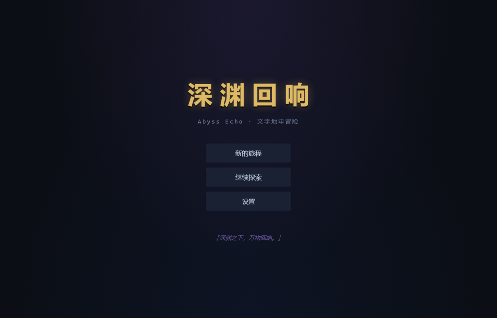
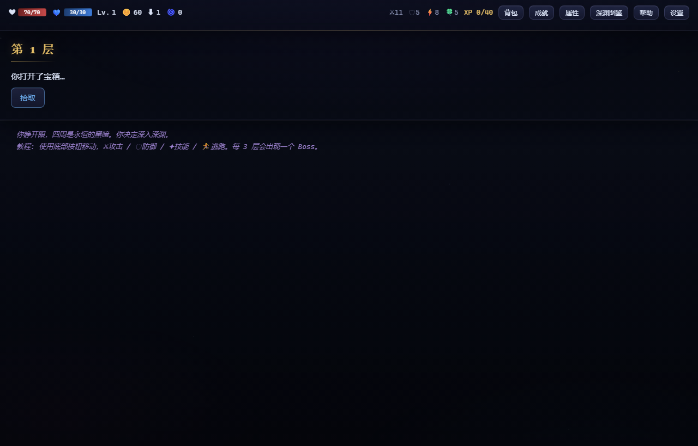
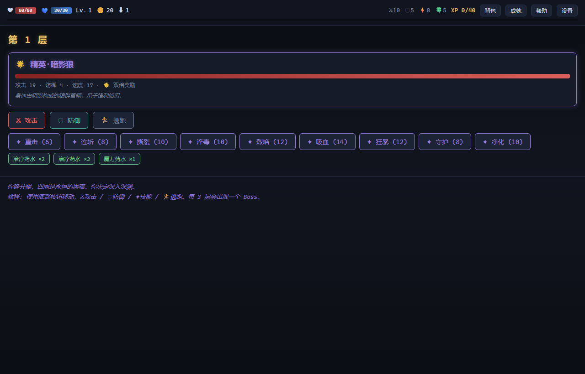
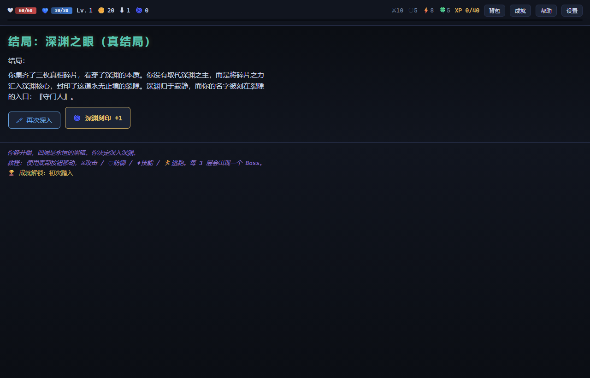
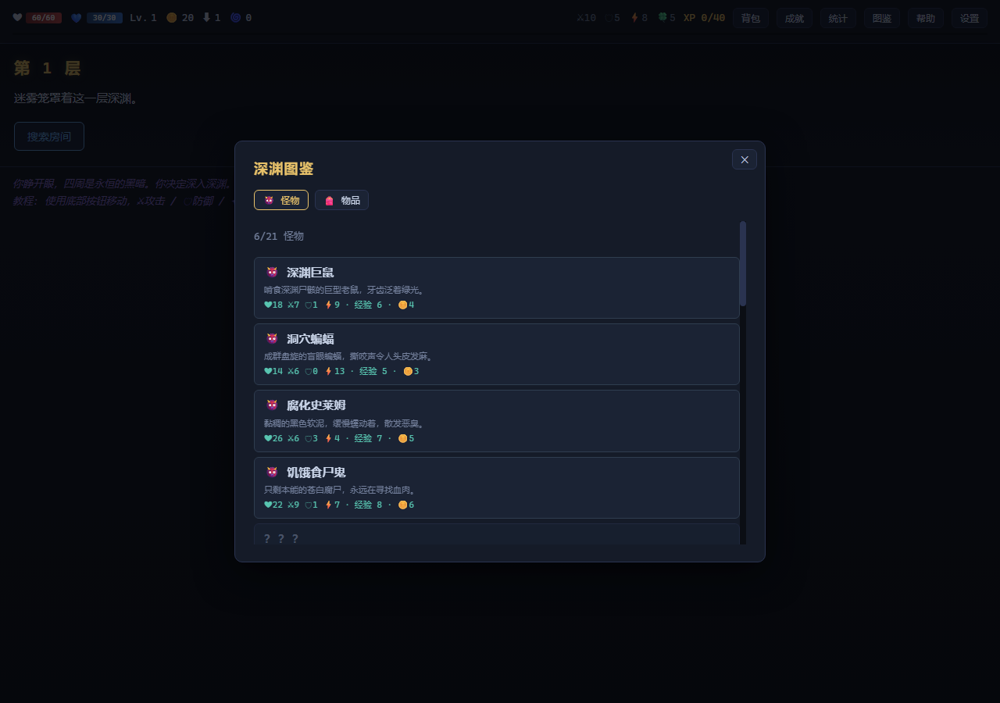

# 深渊回响 · Abyss Echo

> 「深渊之下，万物回响。」 / *"Beneath the abyss, everything echoes."*

一个**零依赖、纯前端**的文字地牢冒险 RPG。克苏鲁黑暗奇幻题材，回合制战斗，12 层深渊，Boss、事件、装备、技能、成就、双结局。打开浏览器就能玩，**无构建、无安装、无网络请求**。

A **zero-dependency, pure front-end** text-based dungeon RPG. Dark cosmic-fantasy theme, turn-based combat, 12 floors of the abyss, bosses, random events, gear, skills, achievements and two endings. Open it in a browser — **no build step, no install, no network calls**.

## 🎮 在线试玩 / Play Online

👉 **https://miku-3993.github.io/abyss-echo/**

或直接下载仓库双击 `index.html`（100% 离线可用）/ Or clone and open `index.html` (fully offline).











## ✨ 特性 / Features

- 🕳️ **12 层深渊** — 每层随机房间：战斗、事件、宝箱、陷阱、营地 / 12 floors of randomized rooms
- ⚔️ **回合制战斗** — 攻击、防御（格挡）、9 种技能、道具、逃跑；暴击、闪避、异常状态（中毒/流血/灼烧/虚弱） / turn-based combat with crits, dodges, status effects
- 🌟 **精英怪** — 15% 概率出现，属性 ×1.5、双倍奖励、必掉一件额外战利品 / elite monsters: 1.5x stats, 2x rewards, guaranteed bonus loot
- 💀 **5 个 Boss** — 每 3 层一位区域 Boss，第 12 层后开启「深渊核心」最终战 / 5 bosses, final boss unlocked after floor 12
- 📜 **12 种随机事件** — 商人、喷泉、祭坛、神龛、矿脉、雕像、蛛巢、占卜师、深渊图书馆…… / merchants, fountains, altars, shrines, fortune tellers…
- 🏆 **22 个成就** — 探索、击杀、等级、收藏、精英猎手、隐藏目标 / achievements for exploration, kills, levels, elites, collection
- 💠 **隐藏真结局** — 收集 3 枚「真相碎片」，在深渊核心做出你的选择 / true ending via 3 fragments of truth
- 🌀 **转生系统** — 达成结局后可转生，永久获得「深渊刻印」：全属性 +4%/级、金币 +5%/级 / rebirth system granting permanent abyss marks
- 🗡️ **29 件物品** — 武器/护甲/饰品/消耗品（含经验典籍、万灵药），BOSS 固定掉落传说装备 / weapons, armor, trinkets, consumables, boss-only legendaries
- 🌏 **中英双语** — 设置面板一键切换 / Chinese & English, switchable in settings
- 🔊 **程序化音效与环境音乐** — Web Audio 实时合成（战斗/探索双场景氛围乐），零音频文件 / procedural SFX + ambient music via Web Audio, zero audio files
- 📋 **委托任务系统** — 悬赏板事件可接取 5 种跨房间委托（精英猎杀/深入/财富/净化/屠夫），HUD 实时进度，完成发奖 / bounty quests with live HUD progress
- ☀️ **每日挑战** — 每天 2-3 个随机规则组合（敌人强化/金币削减/治疗减半/精英倍增…），独立成绩记录 / daily challenge with rotating rule modifiers
- 📜 **深渊图鉴** — 怪物与物品编年史，击杀/收集即解锁条目（跨转生保留） / codex of monsters & items, unlocked by slaying & collecting
- 📊 **统计面板** — 击杀、精英击杀、时间、刻印、碎片、Boss 讨伐记录 / full statistics panel
- 💾 **自动存档** — localStorage + 手动导出/导入 / autosave + manual export/import
- ⌨️ **快捷键** — 战斗中 1/2/3 快速操作 / keyboard shortcuts in combat
- 🌀 **转生难度曲线** — 每枚深渊刻印使敌人属性 +3%，永不停歇的挑战 / enemies scale +3% per abyss mark

## 🎯 快速上手 / Quick Start

```
搜索房间 → 遭遇敌人 → 攻击/技能/道具 → 胜利获得经验与金币 → 升级成长 → 每 3 层 Boss → 第 12 层决战
```

- 防御可格挡减伤；技能消耗魔力且有冷却
- 治疗药水/圣水在战斗中直接使用
- 集齐 3 枚真相碎片（祭坛 / 深渊雕像 / 深渊之主）可解锁**真结局**

## 🧪 测试 / Tests

```bash
npm test        # node --test
```

46 个单元测试覆盖：状态、属性计算、装备加成、战斗结算、状态异常、技能冷却、掉落、精英怪、转生与难度曲线、图鉴记录、每日挑战规则、委托任务、升级、房间生成、成就、存档模拟全流程。

## 🏗 项目结构 / Structure

```
abyss-echo/
├── index.html          # 入口，双击即玩 / entry, play by double-click
├── css/style.css       # 暗黑主题 / dark theme
├── js/
│   ├── lang.js         # 中英双语字典 / i18n dictionary
│   ├── data.js         # 游戏内容数据（敌人/物品/技能/事件/成就） / content data
│   ├── logic.js        # 纯逻辑核心（战斗/生成/掉落/升级）— 可测 / pure logic core
│   ├── audio.js        # Web Audio 程序化音效 / procedural SFX
│   ├── save.js         # localStorage 存档 + 导入导出 / save system
│   ├── ui.js           # 渲染与交互层 / rendering & interaction
│   └── main.js         # 启动入口 / bootstrap
├── test/logic.test.js  # 单元测试 / unit tests
└── docs/               # 截图 / screenshots
```

设计上**逻辑与 DOM 完全分离**：`logic.js` 是纯函数式状态机，可在 Node 中直接测试，`ui.js` 只负责渲染与事件流消费。无任何第三方依赖（连 jQuery 都没有）。

The logic layer (`logic.js`) is a pure state machine decoupled from the DOM — testable in Node directly; `ui.js` only renders and consumes event streams. No third-party dependencies at all.

## 🛠 开发 / Development

```bash
npm test              # 运行测试
# 用任意静态服务器或直接打开 index.html
```

本项目深受 [A Dark Room](https://github.com/doublespeakgames/adarkroom)（7k+ stars）启发：学习其状态管理器、区域模块化、组件化按钮与多语言模式，并以现代零依赖方式重写。

## 🤝 贡献 / Contributing

见 [CONTRIBUTING.md](CONTRIBUTING.md) / See [CONTRIBUTING.md](CONTRIBUTING.md)

## 📄 许可 / License

[MIT](LICENSE) © 2026 Miku-3993